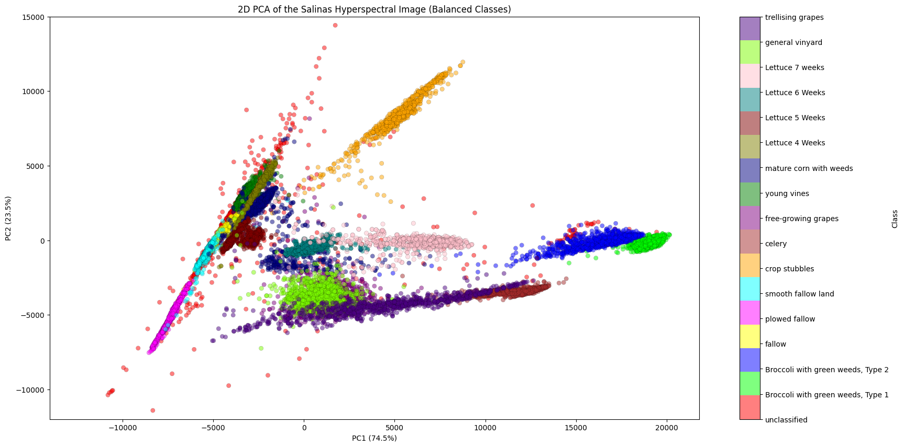

## Dimensionality Reduction Tutorial: PCA on Hyperspectral Data
Hyperspectral images are images captured across a wide range of wavelengths, often hundreds of narrow spectral bands, beyond what the human eye can see. Unlike regular RGB images that use three color bands (red, green, blue), hyperspectral images provide detailed spectral information for each pixel.
They are used in agriculture, environmental monitoring, mineral exploration, surveillance, and medical imaging to identify and analyze materials accurately.

In this tutorial, we will use **Principal Component Analysis (PCA)** for dimensionality reduction on hyperspectral imagery, followed by classification using a **Random Forest**.

---

### Introduction

Hyperspectral images contain hundreds of spectral bands per pixel, resulting in high-dimensional data. Processing and visualizing such data can be challenging due to the **curse of dimensionality**. PCA helps by transforming the data into a lower-dimensional space that retains most of the variance.

**Applications**:

* Preprocessing for classification and clustering
* Visualization of high-dimensional data
* Noise reduction and data compression

---

### 1. Load and Prepare Data

We load the Salinas Valley hyperspectral dataset (MATLAB files) and reshape it into a 2D table where each row is a pixel and each column a spectral band.
[Here](https://www.ehu.eus/ccwintco/index.php/Hyperspectral_Remote_Sensing_Scenes#Salinas) you can find more information about the data source.

```python
import numpy as np
import pandas as pd
import scipy.io

# Read MATLAB file and flatten the image
img = scipy.io.loadmat('dimensionality_dataset_X.mat')['salinas_corrected']  # (rows, cols, bands)
num_bands = img.shape[-1]
flat_img = img.reshape(-1, num_bands)  # flatten to (pixels, bands)
X = pd.DataFrame(flat_img, columns=range(num_bands))  # DataFrame of band values

# Load ground truth labels
y = scipy.io.loadmat('dimensionality_dataset_groundtruth.mat')['salinas_gt'].flatten()

print(X.head())
```

*Comments*: We structure the data for modeling, preserving all spectral bands.

---

### 2. PCA for Variance Retention

We apply PCA to retain 99% of the variance, reducing dimensionality significantly.

```python
from sklearn.decomposition import PCA

# Apply PCA to retain 99% of variance
pca = PCA(n_components=0.99)
X_pca = pca.fit_transform(X)

print('Original dimensions:', X.shape[1])
print('Reduced dimensions:', pca.n_components_)
```

*Explanation*: PCA projects data onto orthogonal axes (principal components) sorted by explained variance. Here, only the top \~3 components are needed to capture 99% variance.

---

### 3. Classification with Random Forest

We compare performance of a Random Forest classifier on raw vs. PCA-transformed data.

```python
from sklearn.ensemble import RandomForestClassifier
from sklearn.model_selection import train_test_split
from sklearn.metrics import f1_score

X_train, X_test, y_train, y_test = train_test_split(X, y, test_size=0.3)
X_train_pca = pca.transform(X_train)
X_test_pca = pca.transform(X_test)

#original data
clf_orig = RandomForestClassifier()
clf_orig.fit(X_train, y_train)
acc_orig = f1_score(y_test, clf_orig.predict(X_test), average='macro') #f1 due to high class imbalance (Gini 0.83)
#reduced data
clf_pca = RandomForestClassifier()
clf_pca.fit(X_train_pca, y_train)
acc_pca = f1_score(y_test, clf_pca.predict(X_test_pca), average='macro')

print('Original f1:',acc_orig)
print('PCA-reduced f1:',acc_pca)
```
The f1-score of the classifier with the original data is at 0.91, and only slightly higher than the PCA-reduced one at 0.86.
Thus, the dimensionality reduction speeds up the training with a minimal loss in accuracy!

---

### 4. Visualizing Clusters in 2D

To interpret class separability, we visualize the first two principal components. Due to class imbalance, we undersample minority classes.

```python
from imblearn.under_sampling import RandomUnderSampler
from matplotlib.colors import ListedColormap
import matplotlib.pyplot as plt

pca_vis = PCA(n_components=2)
X_vis = pca_vis.fit_transform(X)

rus = RandomUnderSampler()
X_vis_balanced, y_vis_balanced = rus.fit_resample(X_vis, y)

plt.figure(figsize=(20, 10))

#manual color mapping because all available cmaps made the classes difficult to distinguish visually!
manual_colors = ['#FF0000', '#00FF00', '#0000FF', '#FFFF00',  # Red, Green, Blue, Yellow
    '#FF00FF', '#00FFFF', '#FFA500', '#A52A2A',  # Magenta, Cyan, Orange, Brown
    '#800080', '#008000', '#000080', '#808000',  # Purple, Dark Green, Navy, Olive
    '#800000', '#008080', '#FFC0CB', '#7CFC00', '#4B0082'] # Maroon, Teal, Pink, Lawn Green, Indigo

cmap = ListedColormap(manual_colors)
classes = np.unique(y_vis_balanced)
colors = [cmap(i / len(classes)) for i in range(len(classes))]
scatter = plt.scatter(X_vis_balanced[:, 0], X_vis_balanced[:, 1], c=y_vis_balanced, cmap=cmap, alpha=0.5,
    edgecolor='k',linewidth=0.2)
cbar = plt.colorbar(scatter, ticks=classes, label='Class')
class_names = ['unclassified','Broccoli with green weeds, Type 1',
'Broccoli with green weeds, Type 2',
'fallow','plowed fallow','smooth fallow land','crop stubbles','celery','free-growing grapes',
'young vines','mature corn with weeds','Lettuce 4 Weeks','Lettuce 5 Weeks','Lettuce 6 Weeks','Lettuce 7 weeks',
'general vinyard','trellising grapes']
cbar.set_ticklabels(class_names)

plt.xlabel(f'PC1 ({round(pca_vis.explained_variance_ratio_[0] * 100, 1)}%)')
plt.ylabel(f'PC2 ({round(pca_vis.explained_variance_ratio_[1] * 100, 1)}%)')
plt.ylim((-12000, 15000)) #not plotting 2-3 unclassified outliers
plt.title('2D PCA of the Salinas Hyperspectral Image (Balanced Classes)')
plt.show()
```


*Interpretation*: Clusters show how different land cover types separate in the reduced space.

---

### Conclusion and Next Steps

* **PCA** effectively reduces dimensions, retaining most variance.
* **Random Forest** on PCA data can match original accuracy with faster computation.
* **Visualization** aids interpretability of complex data.

